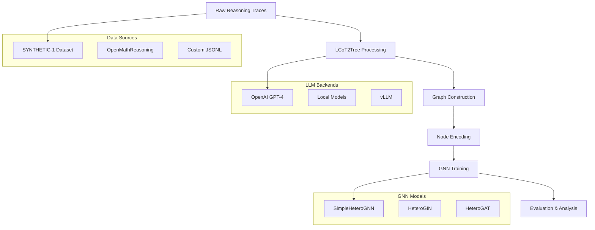

# LCoT2Tree-GNN: Graph Neural Networks for LLM Reasoning Analysis

[](https://www.python.org/downloads/)
[](https://pytorch.org/)
[](https://pytorch-geometric.readthedocs.io/)

**Final project for CS 224W (Stanford Graph Machine Learning)**

This repository implements a comprehensive framework for analyzing Large Language Model (LLM) reasoning traces using Graph Neural Networks (GNNs). The system processes Chain-of-Thought (CoT) reasoning data into structured graphs and trains GNN models to classify reasoning quality and extract important reasoning patterns.

## 🎯 Key Features

- **Multi-format Graph Construction**: Convert reasoning traces into heterogeneous graphs with multiple edge types (continuous logic, exploration, backtracking, validation)
- **Advanced GNN Architectures**: Support for Graph Isomorphism Networks (GIN), Graph Attention Networks (GAT), and heterogeneous variants
- **Text-aware Encoding**: Optional integration of sentence embeddings for enhanced node representations
- **Scalable Data Pipeline**: Process large datasets with parallel LLM calls and optimized graph construction
- **Comprehensive Evaluation**: Built-in metrics, cross-validation, and visualization tools
- **Modular Design**: Extensible architecture supporting different LLM backends and graph formats

## 📊 Pipeline Overview



## 🚀 Quick Start

### 1. Installation

```bash
# Clone the repository
git clone https://github.com/your-repo/cs224w-project.git
cd cs224w-project

# Install dependencies
pip install -r requirements.txt
# or using Poetry
poetry install
```

### 2. Configure LLM Access

Edit `config.json` or set environment variables:

```bash
export OPENAI_API_KEY="your-api-key-here"
```

### 3. Process Data

```bash
# Process SYNTHETIC-1 dataset (default: 3 samples for testing)
python scripts/01_parse_data.py

# Process with custom parameters
python scripts/01_parse_data.py \
  --n_samples 100 \
  --dataset "PrimeIntellect/verifiable-math-problems" \
  --output_dir ./data/processed/my_experiment
```

### 4. Train Model

```bash
# Train on processed data
python scripts/02_train_model.py \
  --pt-file ./data/processed/deepseek/final.pt \
  --model-type hetero_gin \
  --hidden-channels 64 \
  --num-layers 3 \
  --epochs 100

# With cross-validation
python scripts/02_train_model.py \
  --pt-file ./data/processed/deepseek/final.pt \
  --cross-validation \
  --n-folds 5
```

### 5. Evaluate Model

```bash
# Evaluate trained model
python scripts/04_evaluate.py \
  --model-path ./outputs/models/best_model.pth \
  --pt-file ./data/processed/deepseek/final.pt \
  --model-type hetero_gin
```

## 📁 Project Structure

```
cs224w-project/
├── src/
│   ├── data/
│   │   ├── dataset.py          # PyTorch Geometric dataset classes
│   │   ├── graph_builder.py    # LCoT2Tree pipeline & graph construction
│   │   ├── llm_client.py       # LLM backend abstraction
│   │   ├── parser.py           # Data preprocessing utilities
│   │   └── pipeline/           # Modular processing pipeline
│   ├── models/
│   │   └── gin.py              # GNN model implementations
│   └── training/
│       └── trainer.py          # Training loops and utilities
├── scripts/
│   ├── 01_parse_data.py        # Data processing script
│   ├── 02_train_model.py       # Model training script
│   ├── 03_precompute_embeddings.py  # Text embedding computation
│   ├── 04_evaluate.py          # Model evaluation script
│   ├── 01_1_visualize_tree.py  # Graph visualization tools
│   └── training/               # Training shell scripts
├── data/
│   ├── raw/                    # Raw reasoning trace data
│   └── processed/              # Processed graph datasets
├── outputs/                    # Trained models and results
├── LCoT2Tree/                 # LCoT2Tree submodule
├── config.json                 # LLM backend configuration
└── requirements.txt            # Python dependencies
```

## Data Processing Pipeline

### Input Formats

The system supports multiple input formats:

1. **Tree Format** (LCoT2Tree): Hierarchical reasoning trees with `cot_tree` structure
2. **Graph Format**: Explicit `reasoning_graph` with nodes/edges arrays
3. **Raw Text**: Plain reasoning traces (processed via LCoT2Tree)

### Graph Construction

Reasoning traces are converted into heterogeneous graphs where:

- **Nodes**: Represent individual "thoughts" with features like level, category, and text content
- **Edges**: Represent relationships between thoughts:
  - `continuous_logic`: Direct reasoning flow
  - `exploration`: Alternative reasoning paths
  - `backtracking`: Corrections/revisions
  - `validation`: Supporting evidence
  - `root`: Initial connections

### Node Encodings

Multiple node encoding strategies:

- **Tree Encoder**: Learned embeddings for level/category + positional encoding
- **Graph Encoder**: MLP projection of structural features (degree, position)
- **Text-aware Encoder**: Integration of sentence embeddings from thought content
- **Robust Encoder**: Log-normalized features with LayerNorm stabilization

## Model Architectures

### SimpleHeteroGNN
- Projects heterogeneous edges into unified adjacency matrix
- GIN backbone with BatchNorm and ReLU activations
- Global attention pooling for graph-level classification
- Configurable hidden dimensions and layer count

### HeteroGIN & HeteroGAT
- Maintain separate message-passing for each edge type
- Full heterogeneous graph processing
- Support for both GIN and GAT convolution layers

### Key Features
- **Heterogeneous Edge Handling**: Support for multiple relationship types
- **Text Integration**: Optional sentence embeddings for semantic understanding
- **Scalable Design**: Efficient batch processing with PyTorch Geometric
- **Regularization**: Dropout, BatchNorm, and early stopping

## Training & Evaluation

### Training Features
- Stratified train/val/test splits
- Early stopping with configurable patience
- Learning rate scheduling
- Cross-validation support
- Multiple random seeds for reproducibility
- Comprehensive logging and checkpointing

### Metrics
- **Classification**: Accuracy, F1-score, precision, recall
- **Graph Statistics**: Node/edge counts, connectivity analysis
- **Per-class Performance**: Balanced evaluation for correct/incorrect reasoning
- **Cross-validation**: K-fold validation results

### Hyperparameter Sweeps
Automated hyperparameter optimization:

```bash
python scripts/02_1_hparam_sweeps.py \
  --pt-file ./data/processed/deepseek/final.pt \
  --sweep-config config/sweep_config.json
```

## Visualization & Analysis

### Graph Visualization
```bash
# Visualize reasoning graphs
python scripts/01_1_visualize_tree.py \
  --input_file ./data/processed/deepseek/final.json \
  --output_dir ./figures/graphs

# Enhanced visualization with analysis
python scripts/01_4_visualize_enchanced.py \
  --data_path ./data/processed/deepseek/final.pt
```

### Training Analysis
```bash
# Analyze sweep results
python scripts/utils/analyze_sweep_results.py \
  --results_dir ./outputs/sweeps

# Generate training plots
python scripts/utils/generate_plots.py \
  --log_dir ./outputs/training_logs
```

## API Reference

### Core Classes

#### Dataset Classes
```python
from src.data.dataset import ReasoningTraceDataset, PreProcessedDataset

# Load from raw JSONL
dataset = ReasoningTraceDataset(
    root='./data/processed',
    raw_filepath='./data/raw/reasoning_traces.jsonl',
    include_reverse_edges=True
)

# Load from pre-processed .pt file
dataset = PreProcessedDataset(
    pt_filepath='./data/processed/final.pt',
    embedding_dir='./data/embeddings'  # optional
)
```

#### Model Classes
```python
from src.models.gin import create_model

# Create heterogeneous GIN model
model = create_model(
    model_type='hetero_gin',
    num_edge_types=5,
    hidden_channels=64,
    num_layers=3,
    encoder_type='tree',
    num_classes=2
)
```

#### Training
```python
from src.training.trainer import GraphClassificationTrainer, TrainingConfig

config = TrainingConfig(
    epochs=100,
    learning_rate=1e-3,
    patience=20,
    device='auto'
)

trainer = GraphClassificationTrainer(model, config)
trainer.train(train_loader, val_loader)
```

## Advanced Usage

### Custom LLM Backend

```python
from src.data.llm_client import create_llm_client

# Configure custom backend
config = {
    "custom_model": {
        "model_id": "your-model-name",
        "api_key": "your-key",
        "base_url": "your-endpoint",
        "temperature": 0.6
    }
}

client = create_llm_client("custom_model", config)
```

### Custom Graph Construction

```python
from src.data.graph_builder import ReasoningGraphPipeline

pipeline = ReasoningGraphPipeline(
    llm_client=client,
    output_dir='./data/custom',
    max_workers=10,
    batch_size=5
)

results = pipeline.process_reasoning_traces(traces_data)
```

### Text Embedding Integration

```bash
# Pre-compute sentence embeddings
python scripts/03_precompute_embeddings.py \
  --pt-file ./data/processed/final.pt \
  --model-name 'all-MiniLM-L6-v2' \
  --output-dir ./data/embeddings

# Train with text-aware encoder
python scripts/02_train_model.py \
  --pt-file ./data/processed/final.pt \
  --embedding-dir ./data/embeddings \
  --encoder-type text_aware
```

## Contributing

### Development Setup
```bash
# Install development dependencies
pip install -r requirements-dev.txt

# Run tests
python -m pytest tests/

# Format code
black src/ scripts/
isort src/ scripts/
```

### Adding New Models
1. Implement model class in `src/models/`
2. Add creation logic to `create_model()` function
3. Update training script argument parser
4. Add model documentation

### Adding New Data Formats
1. Extend `convert_json_to_hetero_graph()` in `dataset.py`
2. Update format validation logic
3. Add preprocessing utilities in `src/data/parser.py`

## 📄 License

This project is licensed under the MIT License - see the [LICENSE](LICENSE) file for details.

## 🙏 Acknowledgments

- **LCoT2Tree**: Graph-based Chain-of-Thought reasoning framework
- **PyTorch Geometric**: Graph neural network library
- **SYNTHETIC-1 Dataset**: Large-scale reasoning trace dataset
- **Stanford CS 224W**: Stanford graph machine learning course

---
